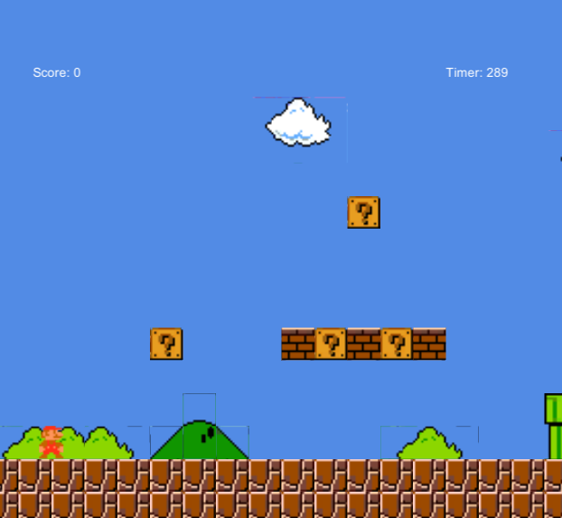
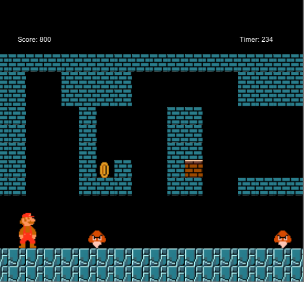

# MarioGame
Recreation of the first two levels of Super Mario Bros. using Unity.

Use WASD to move. Use K to shoot fireballs.

To create an exe file, open in Unity. Go to File/Build Settings and click Build.
